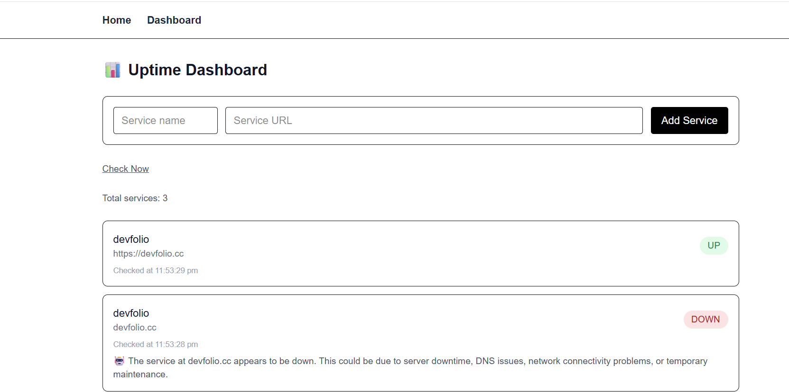

# 🚀 Uptime Monitor (AI-powered)

This is a simple uptime monitoring project that I built to understand how real-world backend systems work.

The app allows users to add website URLs, checks whether they are UP or DOWN, stores the result in a database, and shows everything on a dashboard.  
If a service is DOWN, the system also generates a simple AI-based explanation of what might have gone wrong.

---

## ✨ Why I built this

As a fresher, I wanted to build a project that is:
- Practical and useful
- Not just CRUD
- Similar to real SaaS products
- Helpful for learning backend, databases, and system design

This project is inspired by tools like Uptime Kuma and UptimeRobot, but built from scratch to understand the internals.

---

## ⚙️ What this project does

1. User adds a service URL (example: https://google.com)
2. The system checks the URL using HTTP requests
3. Status is marked as **UP** or **DOWN**
4. Result is stored in PostgreSQL using Prisma
5. If a service is DOWN, an AI-generated message explains possible reasons
6. Dashboard shows all monitored services with latest status

---

## 🧠 Features

- Add and monitor website URLs
- Automatic uptime checks
- PostgreSQL database integration
- Prisma ORM with migrations
- AI-based downtime explanation
- Clean and minimal dashboard UI
- Built using Next.js App Router

---

## 🛠 Tech Stack

- **Frontend & Backend:** Next.js (App Router)
- **Database:** PostgreSQL
- **ORM:** Prisma
- **Runtime:** Node.js
- **AI:** Simple AI-based explanation logic
- **Language:** TypeScript

---

## 📸 Screenshots

_Add screenshots of the Dashboard here_

---

## 🧪 Example Use Case

- Monitoring personal projects
- Checking deployed apps
- Learning how uptime systems work internally
- Understanding backend + database flow

---

## 📂 Project Structure (simplified)

